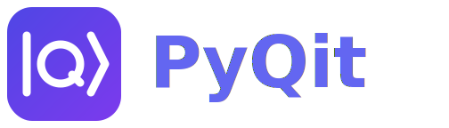

<p align="center">
  
</p>

[](https://www.python.org/downloads/)

[](https://pyqit.readthedocs.io/en/latest/)
[](https://github.com/astral-sh/ruff)
[](https://github.com/phoeenniixx/pyqit/actions)

PyQit is a quantum machine learning framework built on PennyLane. It puts a Trainer, a
DataModule and model classes on top of PennyLane QNodes, so training a variational
circuit is a `fit` call rather than an optimizer loop you write yourself.
[PyTorch](https://pytorch.org/docs/stable/) and
[PyTorch Lightning](https://lightning.ai/docs/pytorch/stable/) are optional. Install
them and the same code trains through PyTorch Lightning instead of autograd. That is the
PyTorch project, not PennyLane's `lightning.qubit` simulator, which is a device and works
on either backend.

Version `0.1.0b1`. The API is unstable and still changing.

The [documentation](https://pyqit.readthedocs.io/en/latest/) has the tutorials, the API
reference and the design notes. This page is the short version.

## Installation

Not on PyPI yet.

```bash
git clone https://github.com/phoeenniixx/pyqit.git
cd pyqit

pip install -e "."                # pennylane and numpy
pip install -e ".[pytorch]"       # adds torch and pytorch lightning
pip install -e ".[all_extras]"    # adds matplotlib and rich as well
```

Quote the extras. `zsh` treats bare brackets as a glob.

## Quickstart

```python
from sklearn.datasets import make_moons

import pyqit
from pyqit.ansatzes import SELAnsatz
from pyqit.core import AngleEmbedding
from pyqit.models import VQCClassifier

pyqit.set_seed(42)

X, y = make_moons(n_samples=200, noise=0.1, random_state=0)

dm = pyqit.DataModule(X, y, normalize="minmax", batch_size=16)

model = VQCClassifier(
    n_qubits=4,
    n_layers=3,
    ansatz=SELAnsatz,
    encoder=AngleEmbedding,
)

trainer = pyqit.Trainer(max_epochs=30, learning_rate=0.05)
history = trainer.fit(model, dm)

print(history.best_epoch, history.best_score)   # 10 0.0936
preds = trainer.predict(model, dm)              # runs on the test split
```

`fit` returns a `TrainingHistory` with one entry per epoch for train and validation loss
and accuracy. The model draws its weights and reads the backend in `__init__`, so seed
and pick the backend before you build it.

## What is in the box

Each item links to its page in the docs.

- [Backends](https://pyqit.readthedocs.io/en/latest/api/trainer.html). `pyqit.set_backend("torch")` moves training to PyTorch Lightning. Same model, same callbacks, same history. PyTorch Lightning settings go through `Trainer(backend_kwargs=...)`.
- [DataModule](https://pyqit.readthedocs.io/en/latest/api/datamodule.html). Nothing runs until the Trainer asks. It splits, fits normalization on the train split only, and prescales inputs for the model's embedding.
- [Callbacks](https://pyqit.readthedocs.io/en/latest/api/callbacks.html). `EarlyStopping` and `ModelCheckpoint` work on both backends. Your own is a `BaseCallback` with up to three methods.
- [Losses](https://pyqit.readthedocs.io/en/latest/api/losses.html). `mse`, `hinge`, `cross_entropy`, or any callable.
- [Barren-plateau check](https://pyqit.readthedocs.io/en/latest/api/diagnostics.html). `Trainer(check_bp=True)` samples gradients at random weights before training and tells you whether their variance sits above the theoretical floor.
- [Pipelines](https://pyqit.readthedocs.io/en/latest/api/pipeline.html). `QuantumPipeline` chains models or runs them as an ensemble.

Tutorials walk through a [VQC end to end](https://pyqit.readthedocs.io/en/latest/tutorials/vqc.html),
[callbacks and checkpoints](https://pyqit.readthedocs.io/en/latest/tutorials/callbacks.html)
and [barren plateaus](https://pyqit.readthedocs.io/en/latest/tutorials/barren_plateau.html).

## Contributing

Issues and pull requests are welcome. The
[contributing guide](https://pyqit.readthedocs.io/en/latest/contributing.html) has the
conventions.

```bash
pip install -e ".[dev,all_extras]"
python -m pytest -n auto
pre-commit run --all-files
```
